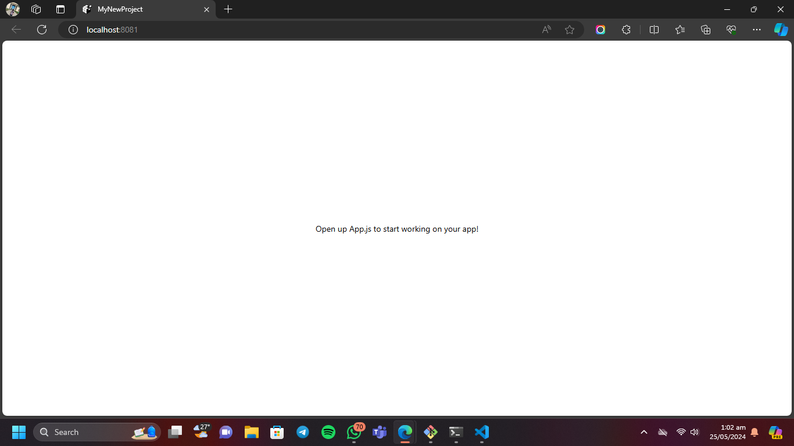
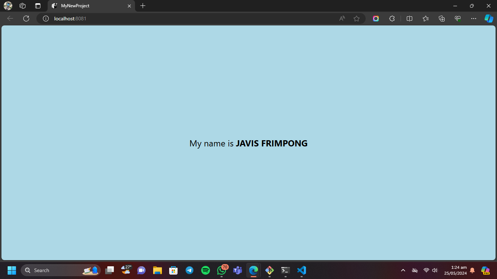

# rn-assignment2-ID-11285447

This is a React Native project created using Expo CLI. It is a simple app that displays a text with a customized background color and style.

# Features
- Changes the background color of the `View` component.
- Displays the text "My name is Javis Frimpong" in the `Text` component.
- Increases the font size of the text to 24.
- Makes the name "Javis Frimpong" bold.

# Screenshots
This is how the Home screen is without styling the text in the `Text` component.

This is how the Home screen is after styling the text in the `Text` component.

# Installation and Usage
1. Clone the repository.
   git clone "https://github.com/Marks-Spencer20/rn-assignment2-ID-11285447.git"

2. Install Expo CLI 
Open your terminal and run the following command to install Expo CLI if you haven't already:
    npm install -g expo-cli

3. Create a New Expo Project
Run the following command to create a new project:
    expo init MyNewProject
NB: Choose the "blank" template when prompted.

4. Navigate to the Project Directory
Move into your project directory:
    cd MyNewProject

5. Start the Project
Start your project using the following command:
   expo start 
NB:  This will open a new browser window with the Expo Developer Tools. From here, you can run your app on an Android or iOS emulator, or on a physical device using the Expo Go app.
